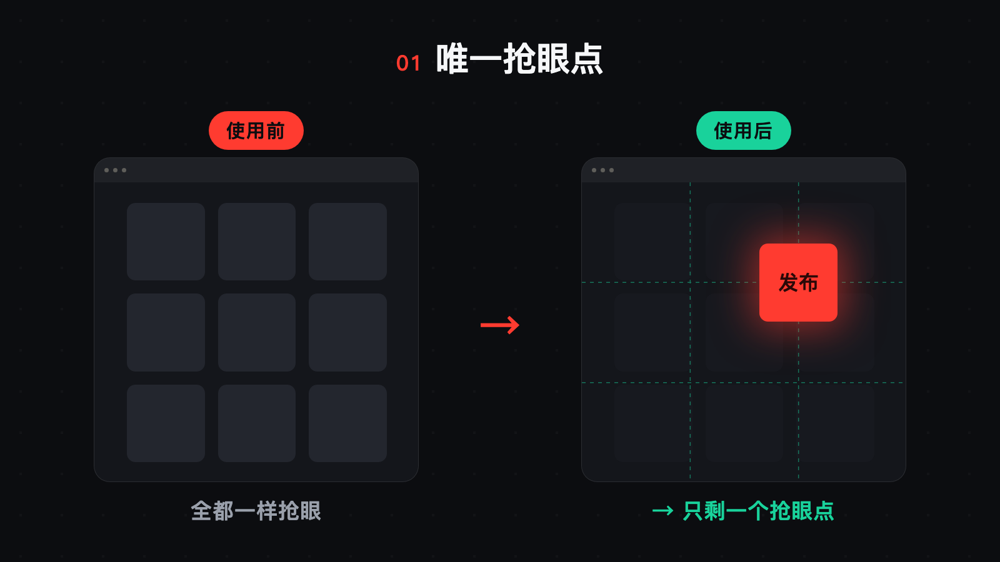
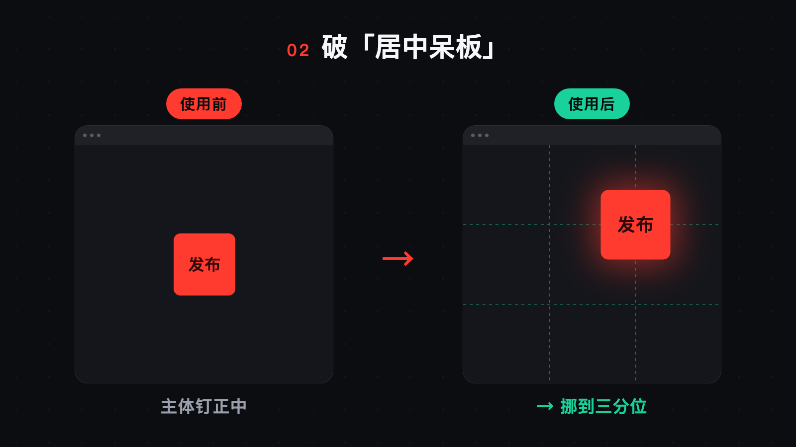
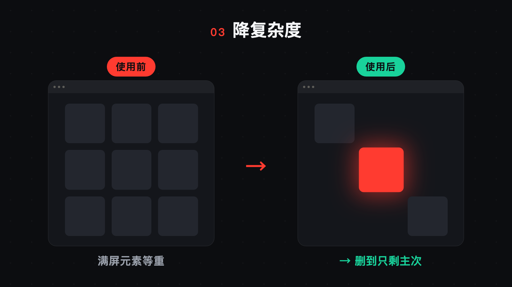
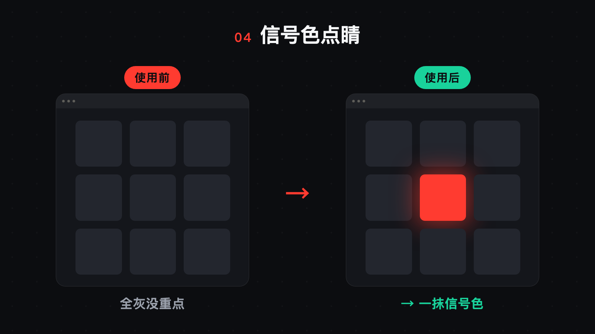
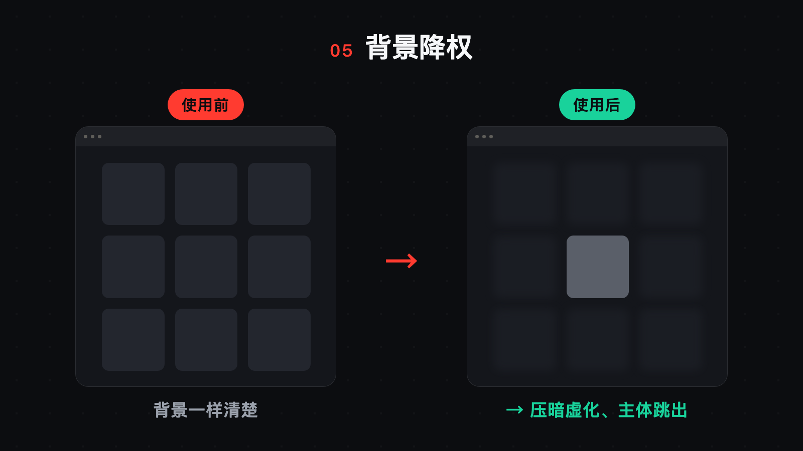
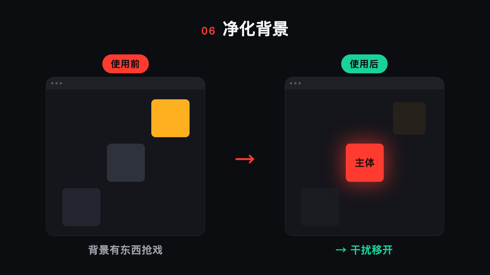
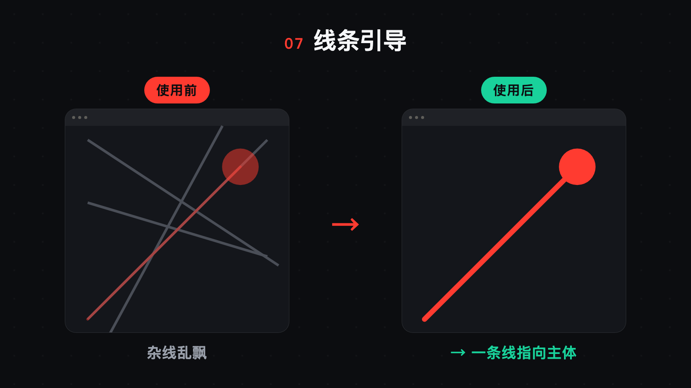
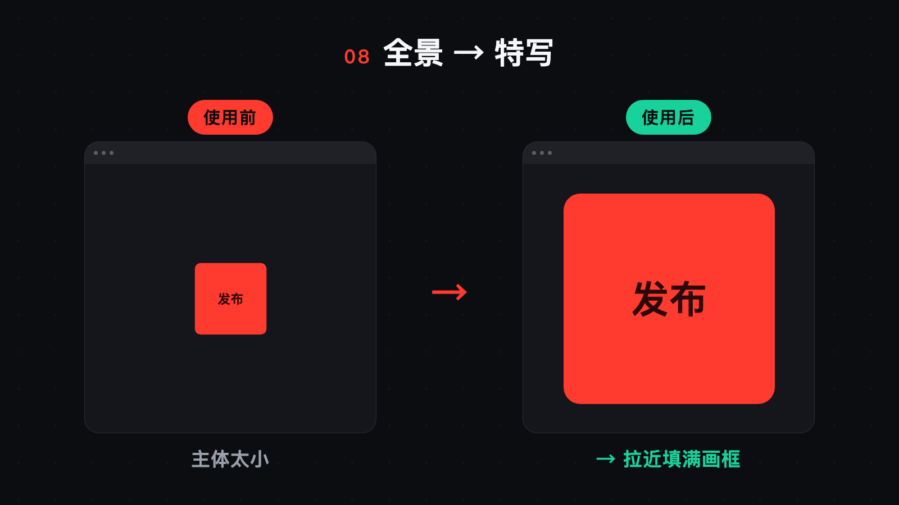

# shot-language · 镜头语言与画面构图判断库

> 一个给 **视频剪辑 / 录屏 / 出镜** 用的 Claude 技能(skill):把摄影构图原理，翻译成"画面好不好、该怎么改"的可执行判断 + 质检清单。
> 来源：科拉·巴尼克 & 格奥尔格·巴尼克《摄影构图与图像语言》。

---

## 这是什么

它不是一个"特效插件"，而是一套**画面判断标准**。

剪视频时你大概率遇到过这种情况：**"这个画面看着别扭，但说不上来哪里不对。"**
这个 skill 就是把"说不上来的感觉"，变成**一条条能复述、能检查的规则**——让你（和 AI）用同一套标准去判断：

- 这一条画面**主次清不清楚**？观众第一眼会看哪？
- 运镜该**拉近到哪**、放在什么位置才不呆板？
- 成片为什么**显得乱 / 显得素**？具体是哪条构图问题？

核心一句话：

> **"设计感"不是往画面里加东西，而是 —— 建立唯一抢眼点 → 引导视线 → 删掉干扰。**

---

## 它在视频剪辑里帮你做什么

| 剪辑环节 | 这个 skill 给你的判断 |
|---|---|
| **选素材 / 定景别** | 哪条画面"主次清楚、一眼读懂"，哪条主体被埋了 |
| **运镜 / punch-in 拉近** | 拉近的本质＝制造抢眼点＋降复杂度；拉到哪、目标放画面什么位置 |
| **出镜机位** | 全景 / 特写怎么切才有节奏；平视 / 微仰 / 俯视各自的心理暗示 |
| **调色** | 色彩为构图服务：用信号色点出主体、别让背景比主体还艳 |
| **成片质检** | 跑"八条典型构图错误"清单，把"看着别扭"定位成可改的项 |

---

## 怎么用

### 方式一：作为 Claude Code 技能（推荐）

把这个仓库放进你项目（或全局）的 skills 目录：

```bash
# 项目级
git clone https://github.com/Penny777btc/shot-language .claude/skills/shot-language

# 或全局级
git clone https://github.com/Penny777btc/shot-language ~/.claude/skills/shot-language
```

之后 Claude 会在你做"选片定景别 / 运镜 / 出镜机位 / 成片质检 / 画面为什么不好看"这类任务时**自动参考它**；你也可以直接说：

> "用 shot-language 看看这段画面有什么问题"

- `SKILL.md` 是操作层（何时用、怎么判断、怎么验收）——日常调用读这层。
- `reference.md` 是原理层（9 章提炼，每条都带"在剪辑里怎么落地")——想知道"为什么"时翻这层。

### 方式二：当成一份"画面构图清单"来读

不用 AI 也行。`SKILL.md` 末尾的**八条构图错误清单**可以直接拿去给自己的成片做体检；下面每个功能点的 before/after 也能当速查卡。

---

## 八个功能点 · 每个都是一组 before / after

这个 skill 不止"一个对比功能"——**每一条构图原理本身，就是一个"常见毛病 → 修法"的 before/after**。
以下 8 条是在"录屏画面"上最常用、最容易立竿见影的：

### 01 · 唯一抢眼点

- **使用前**：9 个元素一样抢眼，观众视线无处落，0.x 秒就被划走。
- **使用后**：只保留一个抢眼点（信号色 + 放大），其余降权。视线被牢牢锁住。
- **剪辑里**：这就是 punch-in 拉近的本质——把观众的眼睛"摁"在你要他看的地方。

### 02 · 破「居中呆板」

- **使用前**：主体死钉正中，画面呆板、乏味（新手头号毛病）。
- **使用后**：挪到三分位（2/3 竖线 × 1/3 横线交点），立刻有张力。
- **剪辑里**：录屏天然偏居中，靠 punch-in 重新构图把目标放到三分位 / 偏上。

### 03 · 降复杂度

- **使用前**：满屏元素、全都等重，观众得自己找重点。
- **使用后**：删到只剩主次——一个主元素 + 少量次要元素。「少即是多」。
- **剪辑里**：一屏信息过载时，要么拆成多屏，要么 punch-in 只留主操作区。

### 04 · 信号色点睛

- **使用前**：画面全是灰，没有重点。
- **使用后**：一抹信号色（红 / 黄）= 天然抢眼点，主体立刻跳出来。
- **剪辑里**：调色 / 加高亮时，用一点信号色指向主体；别让背景出现更艳的色块。

### 05 · 背景降权

- **使用前**：主体和背景一样清楚，糊在一起。
- **使用后**：背景压暗 / 虚化，主体清晰跳出（数字版的浅景深引导）。
- **剪辑里**：录屏背景暗化、punch-in 让目标区清晰，是最强的视线引导之一。

### 06 · 净化背景

- **使用前**：背景有亮色块 / 抢眼物，抢走主体的注意力。
- **使用后**：把干扰移开 / 压掉，画面只剩该看的。
- **剪辑里**：录屏前关掉无关弹窗、出镜前清理背景；剪辑时遮挡或裁掉干扰元素。

### 07 · 线条引导

- **使用前**：杂线乱飘、朝向不一，视线无处跟随。
- **使用后**：留一条主导线指向主体（或角落），视线被牵着走。
- **剪辑里**：UI 的边框 / 分割线就是"线"。让一条主线清晰，弱化杂线；转场方向顺着阅读方向（左→右）显加速。

### 08 · 全景 → 特写

- **使用前**：主体太小，淹没在大画面里。
- **使用后**：拉近填满画框，主体成为绝对主角（「不够好是因为不够近」）。
- **剪辑里**：全景 ↔ 特写交替＝蒙太奇节奏；裁切要"接近"而非"切断"完整元素。

---

## 它不做什么（边界）

- **不替代具体执行**：怎么 ffmpeg 运镜、怎么写 LUT，归剪辑/调色工具。它只管"该不该、往哪、为什么"。
- **不覆盖影视运镜全部**：这本书是**静态构图**，不深讲转场特效、运动镜头编排。
- **不是硬规则**：构图服务于内容与目的，clip 的调性优先（见 `reference.md` 的"关注度 vs 可信度"）。
- **视角 / 焦段**这两条偏真人出镜，抽象画面演示不直观，本文档暂未配图——见 `reference.md` 第 5 节。

---

## 文件结构

```
shot-language/
├── README.md          你正在看的这份说明
├── SKILL.md           技能本体（操作层：何时用 / 怎么判断 / 八条质检清单）
├── reference.md       原理层（9 章深读，每条带"在剪辑里怎么落地"）
├── 用法与效果.md       使用前 vs 使用后的总览对比
└── images/            8 个功能点的 before / after 配图
```

---

*把方法变成能力。*
